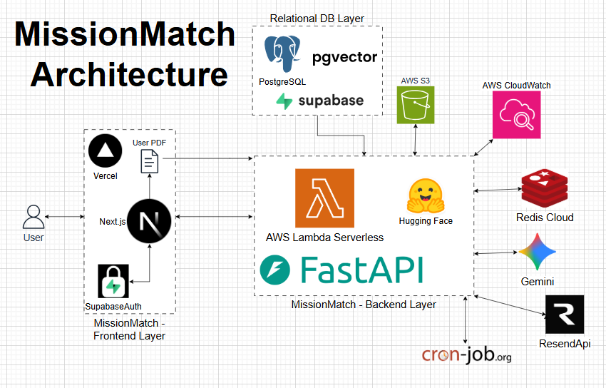

<div align="center">

# MissionMatch

**AI-powered volunteer management platform for animal advocacy organizations.**

[](https://missionmatch.vercel.app/)
[](https://aws.amazon.com/lambda/)
[](https://www.python.org/)
[](https://fastapi.tiangolo.com/)
[](https://nextjs.org/)
[](https://www.typescriptlang.org/)
[](https://tailwindcss.com/)
[](https://supabase.com/)
[](https://www.postgresql.org/)
[](https://redis.io/)
[](https://aws.amazon.com/s3/)
[](https://huggingface.co/)
[](https://ai.google.dev/)

</div>

---

An AI-enabled volunteer management platform powered by AWS - using semantic matching and behavioral analytics to help nonprofit coordinators recruit, retain, and re-engage volunteers before they churn.

**Live Demo: https://missionmatch.vercel.app/** - visit and go to Coordinator Login to explore the dashboard.

---

## Table of Contents

- [Architecture Diagram](#architecture-diagram)
- [Tech Stack](#tech-stack)
- [Demo Video](#demo-video)
- [Features](#features)
- [Thought Process and Tradeoffs](#thought-process-and-tradeoffs)
- [Getting Started](#getting-started)
- [Deployment](#deployment)
- [Environment Variables](#environment-variables)
- [API Endpoints](#api-endpoints)
- [Database Schema](#database-schema)
- [License](#license)

---

## Architecture Diagram

<div align="center">



</div>

---

## Tech Stack

### Frontend

| Technology | Purpose |
|-----------|---------|
| Next.js 16 | React framework with App Router, SSR, middleware |
| TypeScript 5 | Type safety |
| Tailwind CSS 4 | Utility-first styling |
| shadcn/ui | 30+ accessible UI components (Radix primitives) |
| Supabase SSR | Auth middleware (JWT session management) |

### Backend

| Technology | Purpose |
|-----------|---------|
| FastAPI 0.109 | Python ASGI web framework |
| Supabase Python 2.3 | Database client (PostgreSQL + pgvector) |
| HuggingFace Hub | Inference API client for embeddings |
| Google Generative AI | AI chatbot |
| Redis | Notes storage (Redis Cloud) |
| Resend | Transactional email API |

### Infrastructure

| Service | Role |
|---------|------|
| AWS Lambda (eu-north-1) | Serverless backend hosting (Function URL) |
| Vercel | Frontend CDN and edge deployment |
| Supabase | Managed PostgreSQL + pgvector + Auth (JWT) |
| AWS S3 | Document storage |
| Redis Cloud | Redis for caching and coordinator notes |

---

## Demo Video

<div align="center">

[](https://youtube.com)

<!-- Replace the link above with your actual demo video URL -->

</div>

---

## Features

### AI-Powered Volunteer Matching (Routing Engine)
- Converts volunteer bios and task descriptions into 384-dimensional vectors using HuggingFace
- Performs cosine similarity search via pgvector to rank the best-fit volunteers for any task
- Configurable match threshold and result count

### Volunteer Retention Intelligence
- Real-time health monitoring with a computed database view
- Health formula: `score - (days_inactive x 2)` producing Healthy / Warning / At-Risk status
- Dashboard visualizations showing health distribution across all volunteers

### Adaptive Engagement Decay (Cron)
- Daily cron endpoint applies exponential decay: `decay = ceil(base x e^(k x days) x score/100)`
- Score-relative scaling so high-engagement volunteers decay proportionally
- Capped at 15 points/day to prevent score annihilation

### Activity Logging (Engagement Pulse)
- Tracks signup (10pts), task completion (50pts), check-in (5pts), and custom activities
- Automatically updates volunteer engagement scores and last-active timestamps
- Full activity history per volunteer

### AI Assistant
- Coordinator-facing AI assistant with contextual conversation memory
- System prompt tuned for volunteer management, campaign planning, and retention advice
- Conversation history support (last 4 messages for context)

### Email Campaigns
- 4 built-in HTML templates: Welcome, Reminder, Thank You, Campaign Announcement
- Single and bulk email sending via Resend API
- Template variable substitution for personalized outreach

### Document Storage
- Upload PDF, DOCX, TXT, and image files to AWS S3
- Files namespaced by coordinator email for isolation
- Streaming download and file listing

### Coordinator Notes
- Redis-backed quick notes with tagging and search
- Pin important notes to the top
- Full CRUD with tag-based filtering

### Authentication and Authorization
- Supabase Auth with JWT sessions
- Next.js middleware protects all `/coordinator/*` routes
- Role-based access: only users with `role: coordinator` in user_metadata can access the dashboard
- Separate volunteer signup and login flows

---

## Thought Process and Tradeoffs

Every tech choice in this project came from weighing real alternatives. Here is why I picked what I picked.

**Why FastAPI over Spring Boot or Node.js?**
Spring Boot is the enterprise standard for Java APIs, but the JVM overhead and verbose boilerplate make it overkill for a lightweight serverless project. Express.js with Node was tempting for its speed and simplicity, but I wanted Python for the AI/ML ecosystem - HuggingFace, sentence-transformers, and the Google Generative AI SDK all have first-class Python support. FastAPI gives you automatic request validation through Pydantic, auto-generated Swagger docs at `/docs`, and async support out of the box.

**Why AWS Lambda over EC2, Railway, or Render?**
I did not want to manage servers or pay for idle compute. Railway and Render are great for always-on apps, but Lambda scales to zero when nobody is using it, which is ideal for a demo project. The tradeoff is cold starts, but with a 16MB ZIP and Python 3.11, cold starts stay under 3 seconds. I also skipped API Gateway entirely and used Lambda Function URLs directly, which cuts latency and cost. I hated Render's cold starts of around 30 seconds, so I took the plunge and worked with Lambda for the first time for this project.

**Why HuggingFace Inference API over local models or OpenAI embeddings?**
I considered running sentence-transformers locally, but that adds an 80MB+ model download and makes Lambda packaging painful. OpenAI embeddings (text-embedding-ada-002) would work but cost money per request. HuggingFace Inference API gives free access to the same all-MiniLM-L6-v2 model with zero local dependencies. The tradeoff is rate limits on the free tier, but for a volunteer management app, the throughput is more than enough.

**Why pgvector over Pinecone, Weaviate, or FAISS?**
Pinecone and Weaviate are dedicated vector databases, but they add another service to manage and another bill to pay. FAISS is great for local search but does not persist data. pgvector lets me store vectors right next to my relational data in the same Supabase PostgreSQL database. One query can join volunteer metadata with vector similarity results. No separate vector store, no sync issues, no extra infrastructure.

**Why Supabase over Firebase or raw PostgreSQL?**
Firebase is NoSQL (Firestore), which is awkward for relational data like volunteers linked to activity logs. Raw PostgreSQL on RDS would work but requires managing connections, migrations, and auth separately. Supabase gives me PostgreSQL with pgvector, built-in JWT auth, row-level security, and a clean REST API - all managed. The auth integration alone saved me from building a whole authentication layer.

**Why Vercel over Netlify or self-hosting?**
Next.js is built by the Vercel team, so the deployment experience is seamless. Netlify works fine for static sites but Next.js App Router with middleware and SSR runs best on Vercel. Zero-config deployment from a GitHub push was the deciding factor.

---

## Getting Started

### Prerequisites

- Python 3.11+
- Node.js 18+
- A Supabase project with pgvector enabled
- API keys for: HuggingFace (optional), Google Gemini, Resend, AWS S3, Redis Cloud

### Backend Setup

```bash
cd Backend

# Create virtual environment
python -m venv venv
venv\Scripts\activate  # Windows
# source venv/bin/activate  # macOS/Linux

# Install dependencies
pip install -r requirements.txt

# Configure environment
cp .env.example .env
# Edit .env with your API keys and Supabase credentials

# Run locally
python -m app.main
# API docs available at http://localhost:8000/docs
```

### Frontend Setup

```bash
cd Frontend/volunteer-manager

# Install dependencies
npm install

# Configure environment
# Create .env with:
# NEXT_PUBLIC_API_URL=http://localhost:8000
# NEXT_PUBLIC_SUPABASE_URL=https://your-project.supabase.co
# NEXT_PUBLIC_SUPABASE_ANON_KEY=your-anon-key

# Run development server
npm run dev
# Available at http://localhost:3000
```

### Supabase Setup

1. Create a new Supabase project
2. Enable the `vector` extension in SQL Editor: `CREATE EXTENSION IF NOT EXISTS vector;`
3. Create tables (`volunteers`, `tasks`, `activity_logs`) as defined in [Database Schema](#database-schema)
4. Create the `volunteer_retention_status` view
5. Create the `match_volunteers` RPC function for cosine similarity search
6. See [SUPABASE_SETUP_CHECKLIST.md](Backend/SUPABASE_SETUP_CHECKLIST.md) for the full SQL setup

---

## Deployment

### Backend (AWS Lambda)

The backend deploys as a ZIP file to AWS Lambda with a Function URL (no API Gateway needed).

```bash
cd Backend

# Build the deployment ZIP (Linux-compatible binaries)
powershell -ExecutionPolicy Bypass -File build_lambda_zip.ps1
# Produces lambda-deploy.zip (~16 MB)
```

Lambda configuration:
- Runtime: Python 3.11
- Handler: `app.main.handler`
- Memory: 512 MB
- Timeout: 30 seconds
- Function URL: Enabled (Auth type: NONE)
- All environment variables set in Lambda console

### Frontend (Vercel)

1. Connect your GitHub repository to Vercel
2. Set root directory to `Frontend/volunteer-manager`
3. Add environment variables (see below)
4. Deploy (auto-deploys on push to `main`)

---

## Environment Variables

### Backend (.env)

| Variable | Required | Description |
|----------|----------|-------------|
| `SUPABASE_URL` | Yes | Supabase project URL |
| `SUPABASE_KEY` | Yes | Supabase anon/service key |
| `HUGGINGFACE_API_KEY` | No | HuggingFace API key (optional, improves rate limits) |
| `GEMINI_API_KEY` | Yes | Google Gemini API key |
| `S3_ACCESS_KEY_ID` | Yes | AWS S3 access key ID |
| `S3_SECRET_ACCESS_KEY` | Yes | AWS S3 secret access key |
| `S3_REGION` | Yes | S3 bucket region |
| `AWS_S3_BUCKET` | Yes | S3 bucket name |
| `AWS_ENDPOINT_URL` | No | Custom S3 endpoint (for S3-compatible services) |
| `REDIS_HOST` | Yes | Redis Cloud host |
| `REDIS_PORT` | Yes | Redis Cloud port (default: `6379`) |
| `REDIS_PASSWORD` | Yes | Redis Cloud password |
| `RESEND_API_KEY` | Yes | Resend email API key |
| `ENVIRONMENT` | No | `development` or `production` (default: `development`) |

---

## API Endpoints

<details>
<summary><strong>38 endpoints across 7 route modules plus system routes</strong> - click to expand</summary>

### System

| Method | Endpoint | Description |
|--------|----------|-------------|
| GET | `/` | Health check |
| GET | `/health` | Database connectivity check |
| GET | `/info` | System information |
| GET | `/stats` | Dashboard aggregate statistics |
| POST | `/cron/daily-decay` | Daily engagement decay (external cron) |

### Volunteers (`/volunteers`)

| Method | Endpoint | Description |
|--------|----------|-------------|
| POST | `/volunteers` | Create volunteer + generate embedding |
| GET | `/volunteers` | List all volunteers (paginated) |
| GET | `/volunteers/health` | Retention health status (view query) |
| GET | `/volunteers/{id}` | Get volunteer by ID |
| PATCH | `/volunteers/{id}` | Update volunteer (re-embeds if bio/skills change) |
| DELETE | `/volunteers/{id}` | Delete volunteer |

### Tasks (`/tasks`)

| Method | Endpoint | Description |
|--------|----------|-------------|
| POST | `/tasks` | Create task + generate embedding |
| GET | `/tasks` | List all tasks (filterable by status) |
| GET | `/tasks/{id}` | Get task by ID |
| GET | `/tasks/{id}/matches` | Semantic volunteer matching (Routing Engine) |
| GET | `/tasks/{id}/recommendations` | Alias for matches |
| PATCH | `/tasks/{id}` | Update task |
| DELETE | `/tasks/{id}` | Delete task |

### Activities (`/activities`)

| Method | Endpoint | Description |
|--------|----------|-------------|
| POST | `/activities` | Log activity + update engagement score |
| GET | `/activities` | List all activity logs |
| GET | `/activities/volunteer/{id}` | Activity history for a volunteer |
| GET | `/activities/{id}` | Get specific activity log |
| DELETE | `/activities/{id}` | Delete activity log |

### Documents (`/documents`)

| Method | Endpoint | Description |
|--------|----------|-------------|
| POST | `/documents/upload` | Upload file to AWS S3 |
| GET | `/documents/list` | List coordinator documents |
| GET | `/documents/download/{key}` | Download file (streaming) |
| DELETE | `/documents/{key}` | Delete file |

### Chatbot (`/chatbot`)

| Method | Endpoint | Description |
|--------|----------|-------------|
| POST | `/chatbot/chat` | Send message to AI assistant |
| GET | `/chatbot/health` | Chatbot service availability |

### Notes (`/notes`)

| Method | Endpoint | Description |
|--------|----------|-------------|
| POST | `/notes` | Create note (Redis) |
| GET | `/notes` | Get coordinator notes (filterable by tag) |
| GET | `/notes/search` | Search notes by content |
| GET | `/notes/tags` | Get all tags for a coordinator |
| PATCH | `/notes/{id}` | Update note |
| DELETE | `/notes/{id}` | Delete note |
| GET | `/notes/health` | Redis connection health |

### Emails (`/emails`)

| Method | Endpoint | Description |
|--------|----------|-------------|
| POST | `/emails/send` | Send custom HTML email |
| POST | `/emails/send-template` | Send templated email (welcome/reminder/thankyou/event) |
| GET | `/emails/templates` | List available templates |
| GET | `/emails/health` | Email service configuration status |

> Full endpoint documentation with request/response schemas available at `/docs` (Swagger UI) when the backend is running.

</details>

---

## Database Schema

### Tables

**volunteers**
| Column | Type | Description |
|--------|------|-------------|
| id | UUID (PK) | Auto-generated |
| full_name | TEXT | Volunteer name |
| email | TEXT (UNIQUE) | Email address |
| bio | TEXT | Free-text biography |
| skills | TEXT[] | Array of skill tags |
| embedding | VECTOR(384) | Semantic embedding from bio |
| engagement_score | INTEGER | Current engagement score (starts at 100) |
| last_active_at | TIMESTAMPTZ | Last activity timestamp |
| created_at | TIMESTAMPTZ | Registration timestamp |

**tasks**
| Column | Type | Description |
|--------|------|-------------|
| id | UUID (PK) | Auto-generated |
| title | TEXT | Task title |
| description | TEXT | Task description |
| required_skills | TEXT[] | Required skill tags |
| task_vector | VECTOR(384) | Semantic embedding from description |
| status | TEXT | open / filled / completed |
| created_at | TIMESTAMPTZ | Creation timestamp |

**activity_logs**
| Column | Type | Description |
|--------|------|-------------|
| id | SERIAL (PK) | Auto-increment |
| volunteer_id | UUID (FK) | References volunteers.id |
| activity_type | TEXT | signup / task_completion / check_in / custom |
| points_awarded | INTEGER | Points for this activity |
| created_at | TIMESTAMPTZ | Log timestamp |

---

## Possible Improvements

- WebSocket support via API Gateway WebSocket APIs for real-time dashboard updates
- Amazon SQS message queue to decouple email sending and embedding generation from request handling
- Application Load Balancer with multiple Lambda targets for weighted traffic routing and blue/green deployments

---

## License

This project is licensed under the MIT License. See [LICENSE](LICENSE) for details.

---

<div align="center">

Built by [Aranck Jomraj](https://github.com/arancksj22)

FastAPI | Next.js | Supabase | AWS Lambda | HuggingFace | Google Gemini

</div>